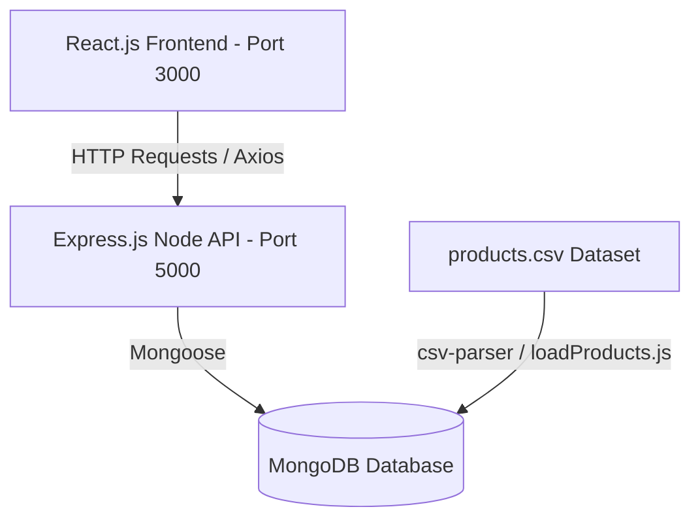

# AuraMarket E-Commerce Catalog Platform (MERN Stack)

🚀 A high-performance, full-stack MERN (MongoDB, Express, React, Node.js) e-commerce product catalog system. The platform manages and displays a massive collection of products with an optimized database design, custom Indian Rupee (₹) price conversions, and realistic category-specific product cover images.

---

## 🌟 Key Features

*   **Premium Glassmorphic UI**: High-end user interface using Bootstrap styling, modern typography (Plus Jakarta Sans), micro-interactions, responsive card grids, and seamless dark/light mode toggle with state persistence.
*   **Normalized Database Architecture**: Scalable relational schema on MongoDB with explicit parent-child collection lookups linking products to unique store departments (`Men` and `Women`).
*   **Realistic Products Seeding**: Auto-seeder streaming `products.csv` to database with:
    *   USD-to-Rupee price conversions (multiplying values by 80 and rounding to the nearest ₹).
    *   Dynamic category-based Unsplash fashion images matching Men/Women trousers, shirts, hoodies, accessories, activewear, etc.
*   **Dynamic Catalog Filters**: Real-time server-side search querying keywords across product names, categories, and brands.
*   **Bookmarkable URL State**: Syncs filter state (categories, brands, price ranges, search keywords, sorting, and pagination) directly with search parameters in the browser URL for bookmarking search results.
*   **Robust Express Rest API**: Decoupled Node.js endpoints with pagination, query sorting, distinct filter aggregation lookup tables, and manual population structures.

---

## 🏗️ Architecture



### Decoupled Directories

1.  **`/backend`**: Contains database schemas (`Product`, `Department`), CSV import logic, data integrity check scripts, and HTTP server endpoint routers.
2.  **`/frontend`**: React client application including API handlers, custom theme stylesheets, and layouts for home stats, search catalogs, details pages, and department filters.

---

## ⚙️ Installation & Running

### Prerequisites

*   Node.js (v16+)
*   MongoDB running locally (`mongodb://localhost:27017`) or a MongoDB Atlas URI

### Setup Backend

1.  Navigate into backend folder:
    ```bash
    cd backend
    ```
2.  Install dependencies:
    ```bash
    npm install
    ```
3.  Configure variables in a `.env` file (optional, defaults to local host):
    ```env
    MONGO_URI=mongodb://127.0.0.1:27017/products_db
    PORT=5000
    IMPORT_LIMIT=5000
    ```
4.  Run data seeders:
    ```bash
    # Import CSV data with INR conversion and image mapping
    npm run load

    # Verify that department normalization maps are seeded
    npm run migrate

    # Inspect seeded statistics and validate database constraints
    npm run verify
    ```
5.  Start server in development mode:
    ```bash
    npm run dev
    ```

### Setup Frontend

1.  Navigate to frontend folder:
    ```bash
    cd ../frontend
    ```
2.  Install dependencies:
    ```bash
    npm install
    ```
3.  Start React application:
    ```bash
    npm start
    ```
    *Open [http://localhost:3000](http://localhost:3000) to browse the catalog.*

---

## 📝 Database Normalization Schemas

### Department Collection
```json
{
  "_id": "ObjectId",
  "id": "Number (Unique Key)",
  "name": "String (e.g., 'Women' or 'Men')",
  "description": "String",
  "isActive": "Boolean",
  "createdAt": "Date",
  "updatedAt": "Date"
}
```

### Product Collection
```json
{
  "_id": "ObjectId",
  "id": "Number (Unique Key)",
  "cost": "Number (INR Value)",
  "retail_price": "Number (INR Original Price)",
  "category": "String",
  "name": "String",
  "brand": "String",
  "department_id": "Number (Foreign Key referencing Department.id)",
  "sku": "String (Unique SKU)",
  "distribution_center_id": "Number",
  "image": "String (Unsplash Cover Image URL)",
  "createdAt": "Date",
  "updatedAt": "Date"
}
```
